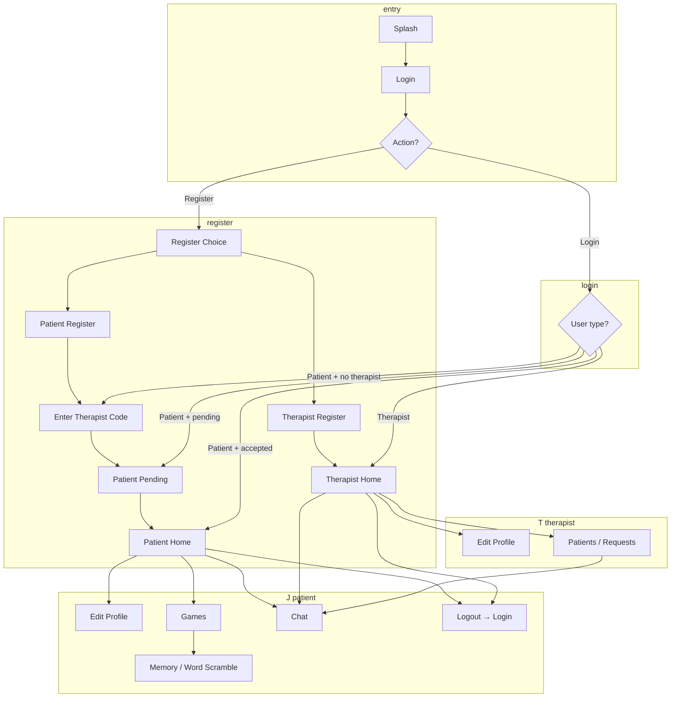

# VocalAid – Dysarthria Speech Therapy Assistant – App Flow

## 1. Entry & auth

```
SplashActivity (launcher)
    ↓
LoginActivity
    ├── [Register] → RegisterChoiceActivity
    │       ├── I'm a Therapist → TherapistRegisterActivity → TherapistHomeActivity
    │       ├── I'm a Patient   → PatientRegisterActivity
    │       │                        ↓
    │       │                   EnterTherapistCodeActivity
    │       │                        ├── Valid code + request sent → PatientPendingActivity
    │       │                        └── Invalid / no code          → (stay or back to Login)
    │       └── [Already have account] → LoginActivity
    │
    └── [Login]
            ├── Therapist → TherapistHomeActivity
            └── Patient
                    ├── Has therapist + accepted → PatientHomeActivity
                    ├── Request pending         → PatientPendingActivity
                    └── No / invalid therapist  → EnterTherapistCodeActivity
```

---

## 2. Patient flow (after login / register)

```
PatientHomeActivity (dashboard)
    ├── Sidebar (drawer)
    │   ├── Overview        → (close drawer, stay on dashboard)
    │   ├── Personalized drills → PersonalDrillsActivity → back to PatientHomeActivity
    │   ├── Edit profile     → EditProfileActivity → back to PatientHomeActivity
    │   ├── Games           → GamesActivity
    │   ├── Chat            → ChatActivity (with therapist) or toast if no therapist
    │   └── Logout          → LoginActivity (clear stack)
    │
    ├── Toolbar menu
    │   ├── Profile  → EditProfileActivity
    │   ├── Games    → GamesActivity
    │   └── Logout   → LoginActivity
    │
    ├── [Message your therapist] → ChatActivity
    ├── [Play games]             → GamesActivity
    └── [Logout]                → LoginActivity

PatientPendingActivity
    └── (when request accepted) → PatientHomeActivity

GamesActivity
    ├── Memory Match → MemoryGameActivity
    └── Word Scramble → WordScrambleActivity

ChatActivity
    └── Back → PatientHomeActivity (or previous screen)
```

---

## 3. Therapist flow (after login / register)

```
TherapistHomeActivity (dashboard)
    ├── Sidebar (drawer)
    │   ├── Overview     → (close drawer, stay on dashboard)
    │   ├── Edit profile → EditProfileActivity → back to TherapistHomeActivity
    │   ├── Your patients → (focus patients list)
    │   └── Logout       → LoginActivity (clear stack)
    │
    ├── Toolbar menu
    │   ├── Profile    → EditProfileActivity
    │   ├── Your patients → (focus patients list)
    │   └── Logout    → LoginActivity
    │
    ├── Patients list → [Message] on a patient → ChatActivity
    ├── Patient requests → [Accept] / [Reject] (in-place)
    └── [Logout] → LoginActivity

ChatActivity
    └── Back → TherapistHomeActivity (or previous screen)
```

---

## 4. Screen list (by role)

| Screen | Patient | Therapist |
|--------|---------|-----------|
| SplashActivity | ✓ entry | ✓ entry |
| LoginActivity | ✓ | ✓ |
| RegisterChoiceActivity | ✓ | ✓ |
| TherapistRegisterActivity | — | ✓ |
| PatientRegisterActivity | ✓ | — |
| EnterTherapistCodeActivity | ✓ | — |
| PatientPendingActivity | ✓ | — |
| PatientHomeActivity | ✓ home | — |
| TherapistHomeActivity | — | ✓ home |
| EditProfileActivity | ✓ | ✓ |
| GamesActivity | ✓ | — |
| MemoryGameActivity | ✓ | — |
| WordScrambleActivity | ✓ | — |
| ChatActivity | ✓ (with therapist) | ✓ (with patient) |
| PersonalDrillsActivity | ✓ | — |
| AssignDrillActivity | — | ✓ (from patient card) |

---

## 5. Simple flowchart (Mermaid)



You can view the Mermaid diagram in GitHub, VS Code (with a Mermaid extension), or [mermaid.live](https://mermaid.live).

---

## 6. Data flow (high level)

- **Auth:** Firebase Auth → on success, read **users** and **Therapist** / **Patient** from Realtime Database to decide home vs pending vs enter code.
- **Patient–therapist link:** Patient enters therapist code → request stored → therapist sees in **Patient requests** → Accept/Reject updates **Patient** (assigned_therapist, status) and request status.
- **Chat:** Conversations and messages stored under **conversations**; ChatActivity uses FirebaseHelper to send/listen.
- **Profile:** EditProfileActivity updates **Therapist** or **Patient** and **users** via FirebaseHelper.
- **Assigned drills:** Therapists assign via AssignDrillActivity to **assigned_drills**; patients view in PersonalDrillsActivity. Deploy `database.rules.json` so Firebase has index on `assigned_drills.patientId`.

This file is the single place to see how the app flows from launch to each role’s home and back.
